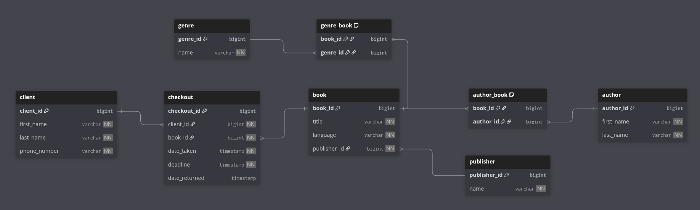

# Library Manager

**Library Manager** is a Java application for managing a library database.
It helps you store all necessary data, such as books, authors, genres, publishers, clients with information about them.

## Technology Stack

**Language:** Java 17

**Frameworks:** Spring Boot, Spring MVC

**Database:** PostgreSQL

**ORM:** JPA

**API:** RESTful API endpoints

**CI/CD:** GitHub Actions

**Build Tool:** Maven 

## Project Structure
```
src/
├── main/
│   ├── java/com/librarymanager/
│   │   ├── controller/
│   │   ├── model/
│   │   ├── repository/
│   │   ├── service/
│   │   └── LibraryManagerApplication.java
│   └── resources/
│       └── application.yml
.github/
└── workflows/
    └── build.yml 
``` 
## Database Structure 



